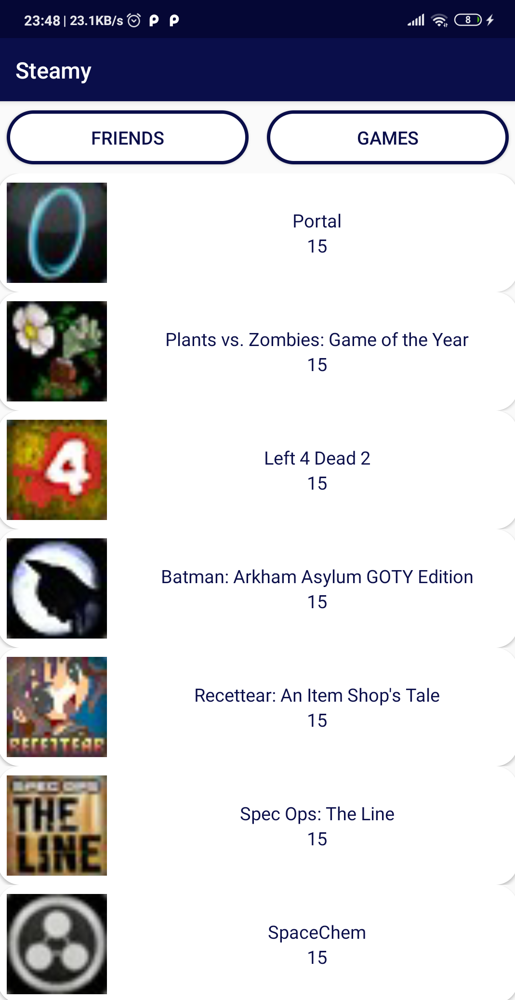

### MEETME 

 
 

**MeetMe is a mobile application that provides an environment for people to talk about their common interests, thoughts and to share their feelings.** 

- When you open the application, first login screen welocmes you.
- You need to enter your steam ID to use the application.

 
 

**REGISTIRATION  AND LOGIN**

   

 
 

**HOME SCREEN**
- When you login Steamy, your Steam games will show up.

  

 
 

**USER PROFILE**

 

 
 

**USER'S FRIENDS**

 
 

**FRIEND'S PROFILE/FRIENDS**
- You can see your friend's profile by clicking any of your friend's name.
- Firstly, your friends's friends will meet you.

 

 
 

**FRIEND'S PROFILE/GAMES**

 

 
 

**GAME NEWS**
- You can view the games' news by clicking any game that you want.

